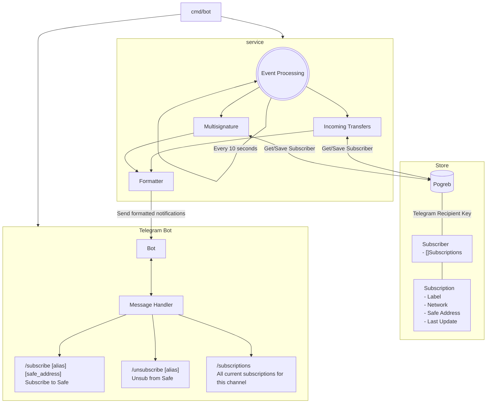

# dao-tg

Telegram bot sending Gnosis Safe notifications

## ⚡ Quickstart

```sh
export BOT_TOKEN="your-telegram-bot-token"
go run cmd/bot
```

## Module


```mermaid
flowchart TB
    subgraph store [Store]
        direction TB
        Store[("Pogreb")]

        Subscriber["Subscriber\n- []Subscriptions"]
        style Subscriber text-align:left

        Subscription["Subscription\n- Label\n- Network\n- Safe Address\n- Last Update"]
        style Subscription text-align:left

        Store -- Telegram Recipient Key --- Subscriber
        Subscriber --- Subscription
    end

    subgraph telegram [Telegram Bot]
        direction LR
        Bot

        Handler["Message Handler"]

        sub["/subscribe [alias] [safe_address]\nSubscribe to Safe"]
        style sub text-align:left

        unsub["/unsubscribe [alias]\nUnsub from Safe"]
        style unsub text-align:left

        subs["/subscriptions\nAll current subscriptions for this channel"]
        style subs text-align:left

        Bot <--> Handler
        Handler --> sub
        Handler --> unsub
        Handler --> subs
    end

    subgraph service
        direction LR
        eventloop(((Event Processing)))

        incoming[Incoming Transfers]
        style incoming text-align:left

        incoming <-- Get/Save Subscriber --> Store

        multisig[Multisignature]
        style multisig text-align:left

        multisig <-- Get/Save Subscriber --> Store

        formatter["Formatter"]

        eventloop -- Every 10 seconds --> eventloop
        eventloop --> incoming
        eventloop --> multisig
        incoming --> formatter
        multisig --> formatter
        formatter -- Send formatted notifications --> Bot
    end
    
    CMD[cmd/bot] --> telegram
    CMD[cmd/bot] --> service
```
